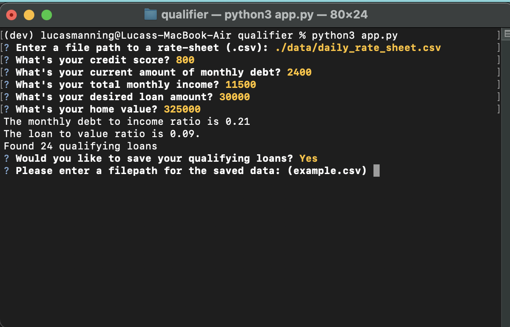

# Loan Qualifier Application

We are creating a CLI application using Python, to determine whether a user qualifies for loans from lenders. By importing a CSV provided from the lenders, we can use the CLI to collect input that will determine the user's eligibility to qualify for selected loans, and will then produce a list of all loans qualified for. 

---

## Technologies

The project uses the following libraries and dependencies:
* Fire - For use of command linne interface
* Questionary - For user dialog
* PyTest - For testing

---

## Installation Guide

Install the following dependencies prior to running the application:

```python
  pip install fire
  pip install questionary
  pip install pytest
```

---
## Examples

Example dialog from CLI running app.py



---


## Contributors

Developed by Lucas Manning
Email: AbsurdSophist@gmail.com

---

## License

UC Berkeley Extension FinTech Program
